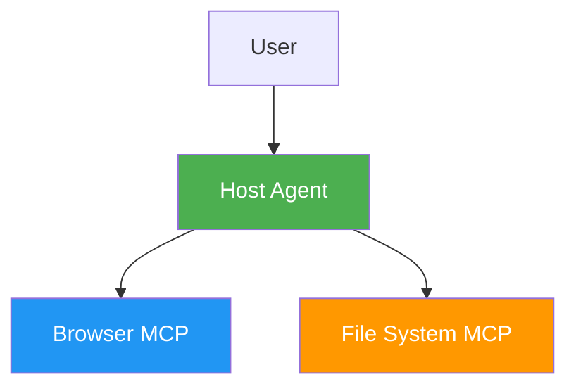

# Mermaid Test

## Simple Diagram

## System Architecture (Simplified)

If you can see diagrams above, Mermaid is working! If not, your markdown preview may not support Mermaid.

**To enable Mermaid in VS Code:**
1. Install "Markdown Preview Mermaid Support" extension
2. Or use "Markdown Preview Enhanced" extension

**To view on GitHub:**
- GitHub natively supports Mermaid in markdown files
- Just push and view on GitHub.com
