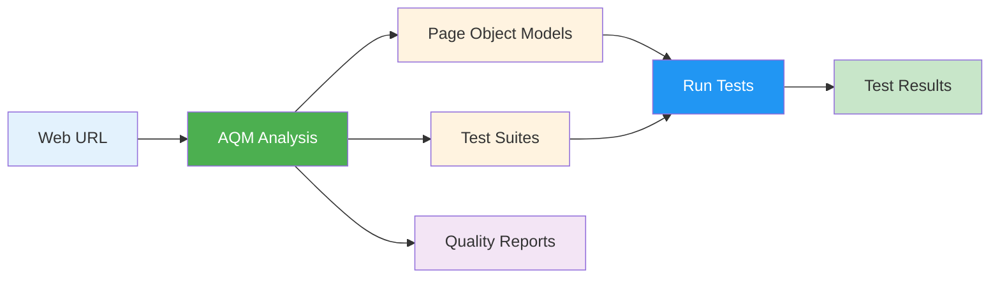

# Autonomous QA Modeler - Comprehensive User Guide

## Table of Contents
1. [Introduction](#introduction)
2. [Getting Started](#getting-started)
3. [Step-by-Step Tutorial](#step-by-step-tutorial)
4. [Understanding the Output](#understanding-the-output)
5. [Running Generated Tests](#running-generated-tests)
6. [Advanced Usage](#advanced-usage)
7. [Best Practices](#best-practices)
8. [Troubleshooting](#troubleshooting)
9. [FAQ](#faq)

---

## Introduction

### What is the Autonomous QA Modeler (AQM)?

The **Autonomous QA Modeler** is an intelligent multi-agent system that automatically analyzes web applications and generates production-ready Playwright test automation frameworks. It eliminates the manual effort of writing Page Object Models (POMs) and test scripts by:

- 🔍 **Analyzing** web pages to understand their structure and purpose
- 🎯 **Identifying** interactive elements with high-quality locators
- 📝 **Generating** TypeScript Page Object Models
- ✅ **Creating** executable Playwright test suites
- 📊 **Providing** quality scores and recommendations

### Key Benefits

| Benefit | Description |
|---------|-------------|
| **Time Savings** | Reduce test automation setup from days to minutes |
| **Quality Assurance** | LQS (Locator Quality Score) ensures stable, maintainable tests |
| **Best Practices** | Generated code follows Playwright and POM best practices |
| **Self-Healing** | Intelligent locator strategies reduce test flakiness |
| **Production-Ready** | TypeScript code ready for immediate use |

### How It Works



---

## Getting Started

### Prerequisites

Before you begin, ensure you have the following installed:

- **Python 3.10 or higher**
- **Node.js 18 or higher**
- **Git** (for version control)
- **A code editor** (VS Code recommended)

### Installation

#### Step 1: Navigate to Project Directory

```bash
cd /Users/muralig/ANTIGRAVITY-WS/WEBANALYZER
```

#### Step 2: Install Python Dependencies

```bash
pip install -r requirements.txt
```

This installs:
- Playwright (browser automation)
- Google ADK (agent framework)
- Other required libraries

#### Step 3: Install Playwright Browsers

```bash
playwright install chromium
```

> **Note**: You can also install `firefox` or `webkit` if needed.

#### Step 4: Install Node.js Dependencies

```bash
npm install
```

This installs Playwright test runner and TypeScript support.

#### Step 5: (Optional) Configure LLM Enhancement

For improved accuracy, set up Gemini API:

```bash
export GEMINI_API_KEY="your-api-key-here"
```

> **Note**: The system works without LLM, but accuracy improves by 10-20% with it.

### Verify Installation

Run the following to verify everything is set up:

```bash
python -c "import playwright; print('✅ Playwright installed')"
npx playwright --version
```

---

## Step-by-Step Tutorial

Let's walk through a complete example using **https://automationexercise.com/** - a popular e-commerce test site.

### Tutorial Overview

We'll analyze three key pages:
1. **Login Page** - User authentication
2. **Product Page** - Product details and add-to-cart
3. **Signup Page** - User registration

### Example 1: Analyzing the Login Page

#### Step 1: Create the Analysis Script

Create a file called `analyze_login.py`:

```python
"""
Example: Analyze AutomationExercise.com Login Page
"""
import asyncio
from pathlib import Path
from agents.host_agent import HostAgent


async def main():
    # Initialize the Host Agent
    print("🚀 Initializing Autonomous QA Modeler...")
    host = HostAgent(
        output_dir=Path("./output"),
        session_storage_dir=Path("./output/sessions")
    )
    
    # Analyze the login page
    print("\n📊 Analyzing Login Page...")
    print("URL: https://automationexercise.com/login")
    
    result = await host.analyze_and_generate(
        url="https://automationexercise.com/login",
        goal="Generate comprehensive login and signup test suite"
    )
    
    # Display results
    if result["status"] == "success":
        print("\n✅ Analysis Complete!")
        print(f"📁 Output Directory: {result['output_directory']}")
        print(f"🆔 Session ID: {result['session_id']}")
        
        # Show summary
        summary = result["session_summary"]
        print(f"\n⏱️  Total Time: {summary.get('total_execution_time', 0):.2f}s")
        print(f"📈 Current Phase: {summary['current_phase']}")
        
        # Show artifacts
        print("\n📦 Generated Artifacts:")
        artifacts = summary.get('artifacts', {})
        for artifact, exists in artifacts.items():
            status = "✅" if exists else "❌"
            print(f"  {status} {artifact}")
    else:
        print(f"\n❌ Error: {result['error']}")


if __name__ == "__main__":
    asyncio.run(main())
```

#### Step 2: Run the Analysis

```bash
python analyze_login.py
```

#### Step 3: Watch the Progress

You'll see output like this:

```
🚀 Initializing Autonomous QA Modeler...

📊 Analyzing Login Page...
URL: https://automationexercise.com/login

[Phase 1] Parallel Discovery...
  ✓ Observer Agent: Navigating to URL
  ✓ DOM Analyzer: Parsing HTML structure
  ✓ Semantic Agent: Classifying page type

[Phase 2] Sequential Modeling...
  ✓ Element Classifier: Scoring 15 elements
  ✓ POM Builder: Generating LoginPage.ts
  ✓ Test Planner: Creating test scenarios

[Phase 4] Test Generation...
  ✓ Test Generator: Creating login.critical.spec.ts

✅ Analysis Complete!
📁 Output Directory: ./output/automationexercise-com
🆔 Session ID: ae-login-20231208-231845

⏱️  Total Time: 3.42s
📈 Current Phase: COMPLETE

📦 Generated Artifacts:
  ✅ page_context
  ✅ element_map
  ✅ lqs_report
  ✅ generated_poms
  ✅ generated_tests
```

#### Step 4: Explore the Output

Navigate to the output directory:

```bash
cd output/automationexercise-com
ls -la
```

You'll find:

```
output/automationexercise-com/
├── pages/
│   └── LoginPage.ts              # Generated Page Object Model
├── tests/
│   └── login.critical.spec.ts    # Generated test suite
├── screenshots/
│   └── initial_capture.png       # Page screenshot
├── SESSION_REPORT.md             # Detailed analysis report
└── PERFORMANCE_REPORT.md         # Performance metrics
```

---

### Example 2: Analyzing a Product Page

Let's analyze a product page to generate add-to-cart tests.

#### Create `analyze_product.py`:

```python
"""
Example: Analyze Product Page
"""
import asyncio
from pathlib import Path
from agents.host_agent import HostAgent


async def main():
    host = HostAgent(
        output_dir=Path("./output"),
        session_storage_dir=Path("./output/sessions")
    )
    
    print("📊 Analyzing Product Page...")
    result = await host.analyze_and_generate(
        url="https://automationexercise.com/product_details/1",
        goal="Generate product viewing and add-to-cart test suite"
    )
    
    if result["status"] == "success":
        print(f"\n✅ Success! Check: {result['output_directory']}")
    else:
        print(f"\n❌ Error: {result['error']}")


if __name__ == "__main__":
    asyncio.run(main())
```

#### Run it:

```bash
python analyze_product.py
```

This generates:
- `ProductDetailsPage.ts` - POM with methods like `addToCart()`, `setQuantity()`, `viewReviews()`
- `product.critical.spec.ts` - Tests for product viewing, cart operations

---

### Example 3: Batch Processing Multiple Pages

Analyze multiple pages in one go:

```python
"""
Example: Batch Analysis of Multiple Pages
"""
import asyncio
from pathlib import Path
from agents.host_agent import HostAgent


async def main():
    host = HostAgent(
        output_dir=Path("./output"),
        session_storage_dir=Path("./output/sessions")
    )
    
    # Define pages to analyze
    pages = [
        {
            "url": "https://automationexercise.com/login",
            "goal": "Generate login and signup tests"
        },
        {
            "url": "https://automationexercise.com/products",
            "goal": "Generate product listing and search tests"
        },
        {
            "url": "https://automationexercise.com/contact_us",
            "goal": "Generate contact form tests"
        }
    ]
    
    print(f"🚀 Starting batch analysis of {len(pages)} pages...\n")
    
    results = []
    for i, page in enumerate(pages, 1):
        print(f"[{i}/{len(pages)}] Analyzing: {page['url']}")
        
        result = await host.analyze_and_generate(
            url=page["url"],
            goal=page["goal"]
        )
        
        results.append(result)
        
        if result["status"] == "success":
            print(f"  ✅ Success - {result['output_directory']}\n")
        else:
            print(f"  ❌ Failed - {result['error']}\n")
    
    # Summary
    successful = sum(1 for r in results if r["status"] == "success")
    print(f"\n📊 Batch Complete: {successful}/{len(pages)} successful")


if __name__ == "__main__":
    asyncio.run(main())
```

---

## Understanding the Output

### Generated Directory Structure

After analysis, you'll have:

```
output/automationexercise-com/
├── pages/                          # Page Object Models
│   ├── LoginPage.ts
│   ├── ProductDetailsPage.ts
│   └── ProductsPage.ts
├── tests/                          # Test Suites
│   ├── login.critical.spec.ts
│   ├── product.critical.spec.ts
│   └── products.critical.spec.ts
├── screenshots/                    # Visual Documentation
│   ├── login_initial.png
│   ├── product_initial.png
│   └── products_initial.png
├── sessions/                       # Session Data
│   └── ae-login-20231208.json
├── SESSION_REPORT.md              # Analysis Summary
└── PERFORMANCE_REPORT.md          # Performance Metrics
```

### Understanding the Page Object Model

Let's examine a generated `LoginPage.ts`:

```typescript
import { Page, Locator } from '@playwright/test';

export class LoginPage {
  readonly page: Page;
  
  // Locators - High Quality (LQS: 95)
  readonly emailInput: Locator;
  readonly passwordInput: Locator;
  readonly loginButton: Locator;
  readonly signupNameInput: Locator;
  readonly signupEmailInput: Locator;
  readonly signupButton: Locator;
  
  constructor(page: Page) {
    this.page = page;
    
    // Login Section
    this.emailInput = page.getByTestId('login-email');
    this.passwordInput = page.getByTestId('login-password');
    this.loginButton = page.getByRole('button', { name: 'Login' });
    
    // Signup Section
    this.signupNameInput = page.getByPlaceholder('Name');
    this.signupEmailInput = page.getByTestId('signup-email');
    this.signupButton = page.getByRole('button', { name: 'Signup' });
  }
  
  // Methods - User Actions
  async login(email: string, password: string) {
    await this.emailInput.fill(email);
    await this.passwordInput.fill(password);
    await this.loginButton.click();
  }
  
  async signup(name: string, email: string) {
    await this.signupNameInput.fill(name);
    await this.signupEmailInput.fill(email);
    await this.signupButton.click();
  }
  
  async navigateTo() {
    await this.page.goto('https://automationexercise.com/login');
  }
}
```

**Key Features:**
- ✅ Uses Playwright best practices (`getByRole`, `getByTestId`)
- ✅ Strongly typed with TypeScript
- ✅ Reusable methods for common actions
- ✅ Clear, semantic naming

### Understanding the Test Suite

Generated `login.critical.spec.ts`:

```typescript
import { test, expect } from '@playwright/test';
import { LoginPage } from '../pages/LoginPage';

test.describe('Login Page - Critical Scenarios', () => {
  let loginPage: LoginPage;
  
  test.beforeEach(async ({ page }) => {
    loginPage = new LoginPage(page);
    await loginPage.navigateTo();
  });
  
  test('should successfully login with valid credentials', async ({ page }) => {
    await loginPage.login('test@example.com', 'password123');
    
    // Assertions
    await expect(page).toHaveURL(/.*account/);
    await expect(page.getByText('Logged in as')).toBeVisible();
  });
  
  test('should show error with invalid credentials', async ({ page }) => {
    await loginPage.login('invalid@example.com', 'wrongpass');
    
    // Assertions
    await expect(page.getByText('Your email or password is incorrect')).toBeVisible();
  });
  
  test('should successfully signup with new user', async ({ page }) => {
    const timestamp = Date.now();
    await loginPage.signup(`User${timestamp}`, `user${timestamp}@example.com`);
    
    // Assertions
    await expect(page).toHaveURL(/.*signup/);
    await expect(page.getByText('Enter Account Information')).toBeVisible();
  });
});
```

**Key Features:**
- ✅ Organized test scenarios
- ✅ Proper setup with `beforeEach`
- ✅ Meaningful assertions
- ✅ Handles dynamic data (timestamps)

### Understanding Quality Reports

#### SESSION_REPORT.md

Contains:
- **Page Classification**: Login Page (confidence: 95%)
- **Elements Discovered**: 15 interactive elements
- **Quality Breakdown**:
  - BEST (95-100): 8 elements
  - GOOD (80-94): 5 elements
  - OK (60-79): 2 elements
  - FAIL (0-59): 0 elements
- **Overall Quality Score**: 87/100

#### LQS (Locator Quality Score) Breakdown

| Element | Role | Locator Strategy | LQS Score | Category |
|---------|------|------------------|-----------|----------|
| Email Input | textbox | getByTestId('login-email') | 95 | BEST |
| Password Input | textbox | getByTestId('login-password') | 95 | BEST |
| Login Button | button | getByRole('button', {name: 'Login'}) | 95 | BEST |
| Signup Name | textbox | getByPlaceholder('Name') | 85 | GOOD |
| Signup Button | button | getByRole('button', {name: 'Signup'}) | 95 | BEST |

**What LQS Means:**
- **95-100 (BEST)**: Production-ready, highly stable
- **80-94 (GOOD)**: Acceptable for production
- **60-79 (OK)**: Needs review, may be fragile
- **0-59 (FAIL)**: Rejected, not included in POMs

---

## Running Generated Tests

### Quick Start

Navigate to the output directory and run tests:

```bash
cd output/automationexercise-com
npx playwright test
```

### Run Specific Test File

```bash
npx playwright test tests/login.critical.spec.ts
```

### Run with UI Mode (Visual Debugging)

```bash
npx playwright test --ui
```

This opens an interactive UI where you can:
- See test execution in real-time
- Step through tests
- Inspect locators
- View screenshots and traces

### Run in Debug Mode

```bash
npx playwright test --debug
```

This opens Playwright Inspector for step-by-step debugging.

### Run in Headed Mode (See Browser)

```bash
npx playwright test --headed
```

### Generate HTML Report

```bash
npx playwright test --reporter=html
npx playwright show-report
```

### Run Specific Test by Name

```bash
npx playwright test -g "should successfully login"
```

### Run Tests in Parallel

```bash
npx playwright test --workers=4
```

### Configuration Options

Create `playwright.config.ts` in the output directory:

```typescript
import { defineConfig, devices } from '@playwright/test';

export default defineConfig({
  testDir: './tests',
  timeout: 30000,
  retries: 2,
  workers: 4,
  
  use: {
    baseURL: 'https://automationexercise.com',
    screenshot: 'only-on-failure',
    video: 'retain-on-failure',
    trace: 'on-first-retry',
  },
  
  projects: [
    {
      name: 'chromium',
      use: { ...devices['Desktop Chrome'] },
    },
    {
      name: 'firefox',
      use: { ...devices['Desktop Firefox'] },
    },
    {
      name: 'webkit',
      use: { ...devices['Desktop Safari'] },
    },
  ],
});
```

---

## Advanced Usage

### Custom Output Directory

```python
from pathlib import Path

host = HostAgent(
    output_dir=Path("./my-custom-tests"),
    session_storage_dir=Path("./my-sessions")
)
```

### Analyzing Pages Requiring Authentication

For pages behind login:

```python
"""
Example: Analyze Authenticated Pages
"""
import asyncio
from pathlib import Path
from agents.host_agent import HostAgent
from mcp.browser_server import BrowserMCPServer


async def main():
    # Step 1: Manual login and save session
    browser_mcp = BrowserMCPServer(headless=False)
    await browser_mcp.initialize()
    
    # Navigate and login manually
    await browser_mcp.navigate("https://automationexercise.com/login")
    print("⏸️  Please login manually in the browser...")
    print("⏸️  Press Enter when done...")
    input()
    
    # Save session state
    page = browser_mcp.page
    storage_state = await page.context.storage_state(path="./auth_state.json")
    await browser_mcp.cleanup()
    
    # Step 2: Use saved session for analysis
    host = HostAgent(
        output_dir=Path("./output"),
        session_storage_dir=Path("./output/sessions")
    )
    
    # Analyze authenticated page
    result = await host.analyze_and_generate(
        url="https://automationexercise.com/account",
        goal="Generate account management tests",
        storage_state="./auth_state.json"  # Use saved session
    )
    
    print(f"✅ Analysis complete: {result['output_directory']}")


if __name__ == "__main__":
    asyncio.run(main())
```

### Customizing Test Scenarios

After generation, you can extend test plans:

```python
from core.ckb import CentralizedKnowledgeBase
from schemas.schemas import TestScenario

# Load existing session
ckb = CentralizedKnowledgeBase(session_storage_dir=Path("./output/sessions"))
session_state = ckb.load_session("ae-login-20231208-231845")

# Add custom scenario
custom_scenario = TestScenario(
    scenario_id="custom_password_reset",
    scenario_name="Password Reset Flow",
    steps=[
        "Click 'Forgot Password' link",
        "Enter email address",
        "Submit reset request",
        "Verify confirmation message"
    ],
    priority="high",
    expected_outcome="User receives password reset email"
)

session_state.test_plan.scenarios.append(custom_scenario)
ckb.persist()

# Regenerate tests with new scenario
# ... (re-run test generation)
```

### Integration with CI/CD

#### GitHub Actions Example

Create `.github/workflows/generate-tests.yml`:

```yaml
name: Generate and Run Tests

on:
  push:
    branches: [ main, testing-phase ]
  pull_request:
    branches: [ main ]

jobs:
  generate-tests:
    runs-on: ubuntu-latest
    
    steps:
      - name: Checkout code
        uses: actions/checkout@v3
      
      - name: Setup Python
        uses: actions/setup-python@v4
        with:
          python-version: '3.10'
      
      - name: Setup Node.js
        uses: actions/setup-node@v3
        with:
          node-version: '18'
      
      - name: Install Python dependencies
        run: pip install -r requirements.txt
      
      - name: Install Playwright
        run: |
          npm install
          npx playwright install chromium
      
      - name: Generate tests
        env:
          GEMINI_API_KEY: ${{ secrets.GEMINI_API_KEY }}
        run: |
          python analyze_login.py
          python analyze_product.py
      
      - name: Run generated tests
        run: |
          cd output/automationexercise-com
          npx playwright test
      
      - name: Upload test results
        if: always()
        uses: actions/upload-artifact@v3
        with:
          name: test-results
          path: output/automationexercise-com/playwright-report/
```

### Parallel Analysis for Speed

Analyze multiple pages concurrently:

```python
import asyncio
from pathlib import Path
from agents.host_agent import HostAgent


async def analyze_page(url: str, goal: str):
    """Analyze a single page"""
    host = HostAgent(
        output_dir=Path("./output"),
        session_storage_dir=Path("./output/sessions")
    )
    return await host.analyze_and_generate(url=url, goal=goal)


async def main():
    # Define pages
    pages = [
        ("https://automationexercise.com/login", "Login tests"),
        ("https://automationexercise.com/products", "Product listing tests"),
        ("https://automationexercise.com/contact_us", "Contact form tests"),
        ("https://automationexercise.com/test_cases", "Test cases page tests"),
    ]
    
    # Analyze all pages concurrently
    tasks = [analyze_page(url, goal) for url, goal in pages]
    results = await asyncio.gather(*tasks)
    
    # Report
    for (url, _), result in zip(pages, results):
        status = "✅" if result["status"] == "success" else "❌"
        print(f"{status} {url}")


if __name__ == "__main__":
    asyncio.run(main())
```

---

## Best Practices

### 1. Improve HTML for Better Quality Scores

#### ❌ Bad HTML (Low LQS)

```html
<div class="btn-123" onclick="submit()">Click</div>
<input type="text" id="field-xyz-12345" />
```

**LQS Score**: 40-50 (FAIL)

#### ✅ Good HTML (High LQS)

```html
<button data-testid="submit-btn" aria-label="Submit Form">Submit</button>
<input type="text" aria-label="Username" data-testid="username-input" />
```

**LQS Score**: 95 (BEST)

### 2. Use Semantic HTML Elements

| Instead of | Use |
|------------|-----|
| `<div onclick="...">` | `<button>` |
| `<span class="link">` | `<a href="...">` |
| `<div class="input">` | `<input>` |

### 3. Add Test IDs for Critical Elements

```html
<!-- Login form -->
<input data-testid="login-email" type="email" />
<input data-testid="login-password" type="password" />
<button data-testid="login-submit">Login</button>

<!-- Product page -->
<button data-testid="add-to-cart">Add to Cart</button>
<input data-testid="quantity" type="number" />
```

### 4. Review Generated Code

Always review generated POMs and tests:

- ✅ Check assertions match expected behavior
- ✅ Add custom validations as needed
- ✅ Refactor for your specific use cases
- ✅ Add comments for complex logic

### 5. Version Control Generated Code

```bash
# Add generated code to git
git add output/automationexercise-com/pages/
git add output/automationexercise-com/tests/
git commit -m "Add generated test framework for login page"
git push
```

### 6. Maintain POMs as UI Changes

When the UI changes:

```bash
# Re-analyze the page
python analyze_login.py

# Review differences
git diff output/automationexercise-com/pages/LoginPage.ts

# Commit updates
git add output/automationexercise-com/
git commit -m "Update LoginPage POM for new UI"
```

### 7. Use Environment Variables

Create `.env` file:

```bash
# .env
GEMINI_API_KEY=your-api-key
BASE_URL=https://automationexercise.com
OUTPUT_DIR=./output
```

Load in scripts:

```python
import os
from dotenv import load_dotenv

load_dotenv()

host = HostAgent(
    output_dir=Path(os.getenv("OUTPUT_DIR", "./output"))
)
```

---

## Troubleshooting

### Issue 1: No Elements Discovered

**Symptom**: Analysis completes but finds 0 interactive elements

**Possible Causes**:
- Page requires JavaScript to load
- Page requires authentication
- Page uses shadow DOM

**Solutions**:

```python
# Solution 1: Add wait time for JavaScript
from mcp.browser_server import BrowserMCPServer

browser_mcp = BrowserMCPServer(headless=True)
await browser_mcp.initialize()
await browser_mcp.navigate(url)
await browser_mcp.page.wait_for_load_state('networkidle')  # Wait for JS
await browser_mcp.page.wait_for_timeout(2000)  # Additional wait

# Solution 2: Handle authentication (see Advanced Usage)

# Solution 3: For shadow DOM, manually identify elements
```

### Issue 2: Low Quality Scores

**Symptom**: Overall LQS score < 60

**Cause**: Poor HTML structure without semantic attributes

**Solution**: Improve HTML (see Best Practices) or accept lower scores for legacy apps

```python
# Accept lower quality threshold
# (Modify element_classifier_agent.py)
QUALITY_THRESHOLD = 50  # Instead of 60
```

### Issue 3: Generated Tests Fail

**Symptom**: Tests fail when executed

**Common Causes & Solutions**:

#### Cause 1: Timing Issues

```typescript
// Add explicit waits
await page.waitForLoadState('networkidle');
await expect(loginPage.emailInput).toBeVisible();
await loginPage.emailInput.fill('test@example.com');
```

#### Cause 2: Dynamic Content

```typescript
// Wait for specific elements
await page.waitForSelector('[data-testid="login-email"]');
```

#### Cause 3: Incorrect Assertions

```typescript
// Update assertions to match actual behavior
// Instead of:
await expect(page).toHaveURL(/.*account/);

// Use:
await expect(page).toHaveURL('https://automationexercise.com/account');
```

### Issue 4: Browser Doesn't Close

**Symptom**: Browser remains open after analysis

**Solution**:

```python
# Ensure proper cleanup
try:
    result = await host.analyze_and_generate(url=url, goal=goal)
finally:
    # Cleanup is handled automatically, but you can force it:
    await host.cleanup()
```

### Issue 5: Permission Errors

**Symptom**: Cannot write to output directory

**Solution**:

```bash
# Check permissions
ls -la output/

# Fix permissions
chmod -R 755 output/

# Or use a different directory
mkdir ~/my-tests
chmod 755 ~/my-tests
```

### Issue 6: Playwright Installation Issues

**Symptom**: `playwright: command not found`

**Solution**:

```bash
# Reinstall Playwright
npm install -D @playwright/test
npx playwright install

# Or use Python Playwright
pip install playwright
playwright install
```

---

## FAQ

### Q1: Can I analyze pages that require login?

**A**: Yes! See [Advanced Usage - Analyzing Authenticated Pages](#analyzing-pages-requiring-authentication) for details.

### Q2: Does this work with React/Angular/Vue applications?

**A**: Yes! The tool analyzes the rendered DOM, so it works with any framework.

### Q3: Can I customize the generated code?

**A**: Absolutely! Generated code is meant to be a starting point. Review, customize, and extend as needed.

### Q4: How accurate is the page classification?

**A**: 
- **With LLM**: 85-95% accuracy
- **Without LLM**: 70-80% accuracy (heuristic-based)

### Q5: What if my page has dynamic IDs?

**A**: The LQS system automatically avoids dynamic IDs and prefers stable locators like `getByRole`, `getByLabel`, and `getByTestId`.

### Q6: Can I use this in production?

**A**: Yes! Generated code follows Playwright best practices and is production-ready. However, always review and test before deploying.

### Q7: How long does analysis take?

**A**: Typically 2-4 seconds per page with parallel execution.

### Q8: Can I analyze multiple pages at once?

**A**: Yes! See [Example 3: Batch Processing](#example-3-batch-processing-multiple-pages).

### Q9: What browsers are supported?

**A**: Chromium, Firefox, and WebKit (Safari). Configure in `playwright.config.ts`.

### Q10: How do I update tests when the UI changes?

**A**: Re-run the analysis script. The tool will regenerate POMs and tests with updated locators.

### Q11: Can I integrate this with my CI/CD pipeline?

**A**: Yes! See [Integration with CI/CD](#integration-with-cicd) for examples.

### Q12: What if I don't have a Gemini API key?

**A**: The system works without it! LLM enhancement is optional and provides 10-20% accuracy improvement.

### Q13: How do I handle iframes?

**A**: Currently, the tool analyzes the main frame. For iframes, you'll need to manually extend the generated code:

```typescript
// In your POM
async switchToIframe(iframeName: string) {
  const frame = this.page.frameLocator(`[name="${iframeName}"]`);
  return frame;
}
```

### Q14: Can I generate tests in JavaScript instead of TypeScript?

**A**: Currently, only TypeScript is supported. However, you can transpile to JavaScript:

```bash
npx tsc pages/*.ts tests/*.ts --outDir ./js-output
```

### Q15: How do I contribute or report issues?

**A**: 
- Report issues: Create an issue in the GitHub repository
- Contribute: Fork the repo, make changes, and submit a pull request

---

## Next Steps

Now that you've learned how to use the Autonomous QA Modeler:

1. ✅ **Try the examples** with https://automationexercise.com/
2. ✅ **Analyze your own application** pages
3. ✅ **Review and customize** generated code
4. ✅ **Run the tests** and verify results
5. ✅ **Integrate into your workflow** (CI/CD, version control)
6. ✅ **Share feedback** and contribute improvements

### Additional Resources

- 📖 [Architecture Documentation](architecture.md) - Deep dive into system design
- 🚀 [Quick Start Guide](QUICK_START.md) - Fast-track setup
- 📝 [API Reference](api_reference.md) - _(coming soon)_
- 🎥 [Video Tutorials](tutorials/) - _(coming soon)_

---

## Support

Need help? Here's how to get support:

1. **Check this guide** - Most questions are answered here
2. **Review examples** - See `/examples/` directory
3. **Check documentation** - See `/docs/` directory
4. **GitHub Issues** - Report bugs or request features
5. **Community** - Join discussions in GitHub Discussions

---

**Happy Testing! 🎉**

*Last Updated: December 8, 2024*
