# Autonomous QA Modeler - Architecture Documentation

## Table of Contents
1. [System Overview](#system-overview)
2. [High-Level Architecture](#high-level-architecture)
3. [Agent Hierarchy](#agent-hierarchy)
4. [Phase Workflows](#phase-workflows)
5. [Data Flow](#data-flow)
6. [Component Details](#component-details)
7. [Integration Patterns](#integration-patterns)
8. [Quality Gates](#quality-gates)

---

## System Overview

The **Autonomous QA Modeler (AQM)** is a multi-agent system that autonomously generates production-ready Playwright test automation frameworks from web URLs.

### Core Capabilities
- **Automated Analysis**: Analyzes web pages to understand structure and purpose
- **Quality Enforcement**: LQS (Locator Quality Score) ensures only stable locators
- **Code Generation**: Produces TypeScript POMs and executable tests
- **LLM Enhancement**: Optional Gemini API integration for improved accuracy

### Key Metrics
- **Analysis Time**: 2-4 seconds per page
- **Code Quality**: Production-ready TypeScript
- **Test Coverage**: Scenario-based with assertions
- **Quality Score**: 60-95 average LQS

---

## High-Level Architecture

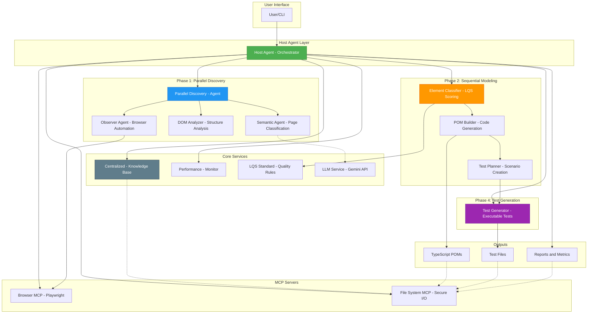

---

## Agent Hierarchy

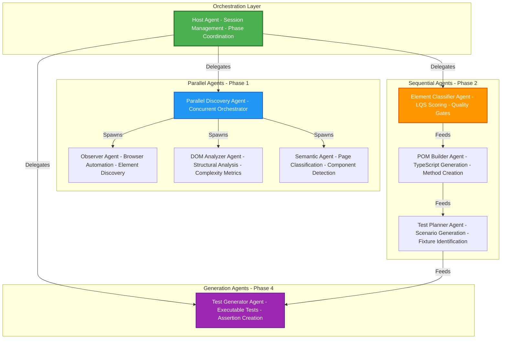

### Agent Responsibilities

| Agent | Type | Responsibilities | Output |
|-------|------|------------------|--------|
| **Host Agent** | Orchestrator | Session management, phase coordination, artifact persistence | Session reports |
| **Parallel Discovery** | Orchestrator | Concurrent execution, TTLX optimization | Aggregated results |
| **Observer** | Worker | Browser automation, DOM capture, element discovery | Raw element data |
| **DOM Analyzer** | Worker | HTML parsing, structural analysis, complexity scoring | DOM metrics |
| **Semantic** | Worker | Page classification, component detection | Page context |
| **Element Classifier** | Worker | LQS scoring, quality categorization | LQS report |
| **POM Builder** | Generator | TypeScript code generation, method creation | POM files |
| **Test Planner** | Planner | Scenario generation, fixture identification | Test plan |
| **Test Generator** | Generator | Executable test creation, assertion generation | Test files |

---

## Phase Workflows

### Phase 1: Parallel Discovery (TTLX Optimized)

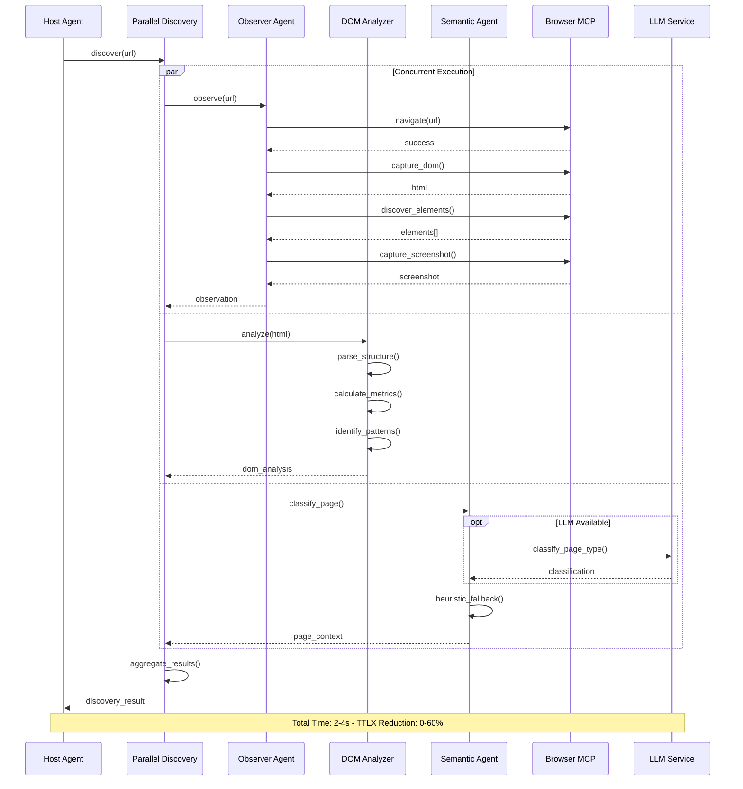

### Phase 2: Sequential Modeling (Quality Gates)

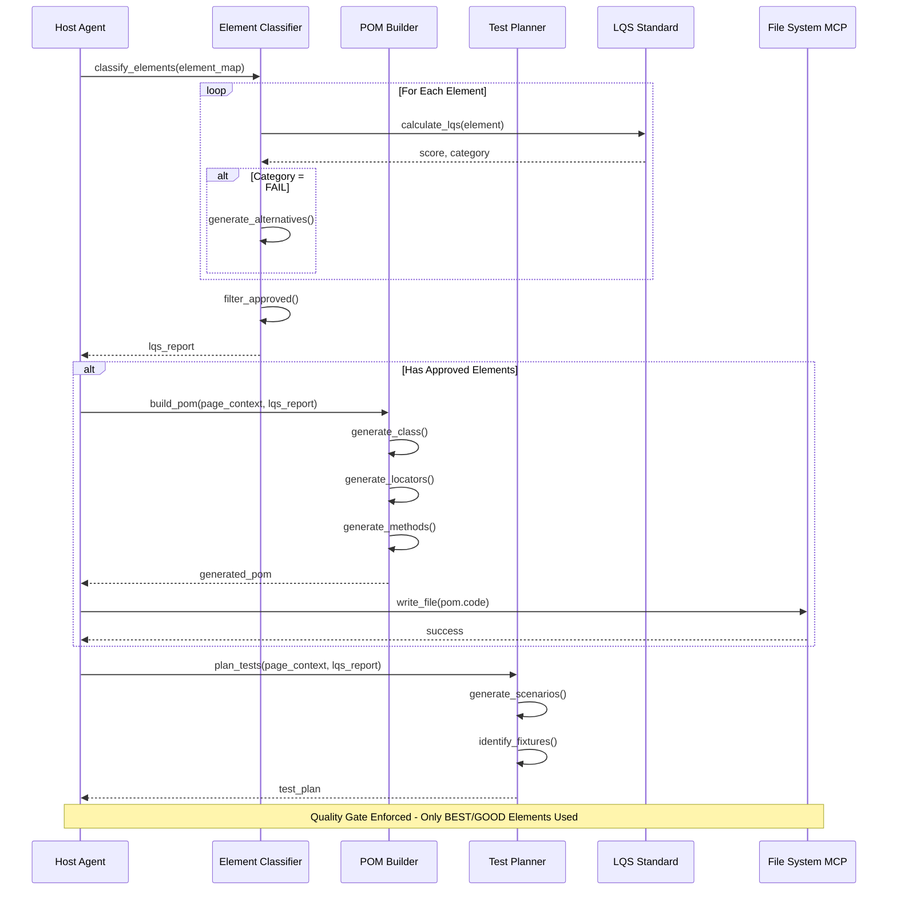

### Phase 4: Test Generation

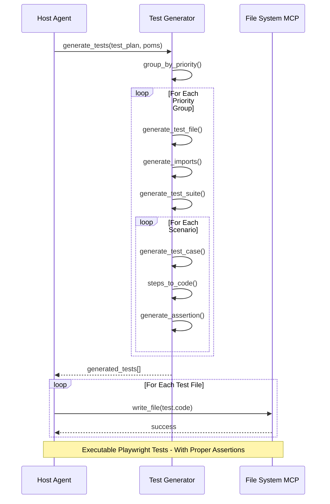

---

## Data Flow

### Complete System Data Flow

```mermaid
graph LR
    subgraph "Input"
        URL[Web URL]
    end
    
    subgraph "Phase 1 Outputs"
        PC[PageContextOntology - - page_type - - purpose - - confidence]
        EM[ElementClassificationMap - - elements[] - - total_count]
        DA[DOM Analysis - - metrics - - patterns - - complexity]
    end
    
    subgraph "Phase 2 Outputs"
        LR[LQS Report - - approved[] - - flagged[] - - rejected[] - - quality_score]
        POM[Generated POM - - class_name - - code - - methods]
        TP[Test Plan - - scenarios[] - - fixtures - - coverage]
    end
    
    subgraph "Phase 4 Outputs"
        GT[Generated Tests - - test_name - - code - - assertions]
    end
    
    subgraph "Artifacts"
        POMF[LoginPage.ts]
        TESTF[login.spec.ts]
        REP[Reports]
        SS[Screenshots]
    end
    
    URL --> PC
    URL --> EM
    URL --> DA
    
    EM --> LR
    PC --> LR
    
    LR --> POM
    PC --> POM
    
    LR --> TP
    PC --> TP
    
    POM --> GT
    TP --> GT
    
    POM --> POMF
    GT --> TESTF
    PC --> REP
    LR --> REP
    EM --> SS
    
    style PC fill:#E3F2FD
    style EM fill:#E3F2FD
    style LR fill:#FFF3E0
    style POM fill:#FFF3E0
    style GT fill:#F3E5F5
    style POMF fill:#C8E6C9
    style TESTF fill:#C8E6C9
```

### Schema Relationships

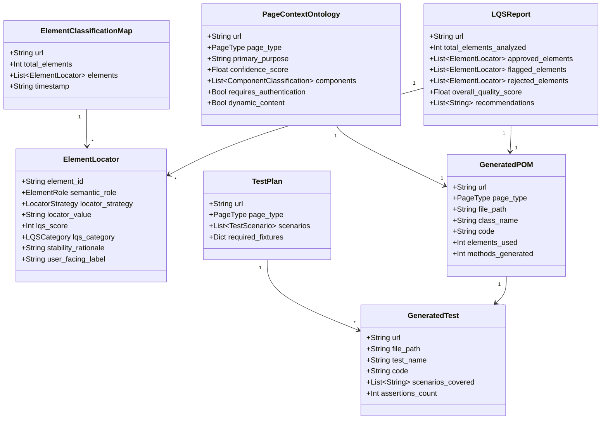

---

## Component Details

### MCP Servers

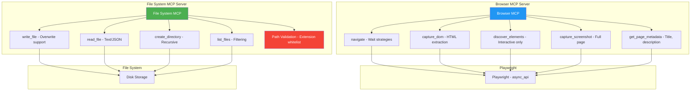

### LQS (Locator Quality Score) System

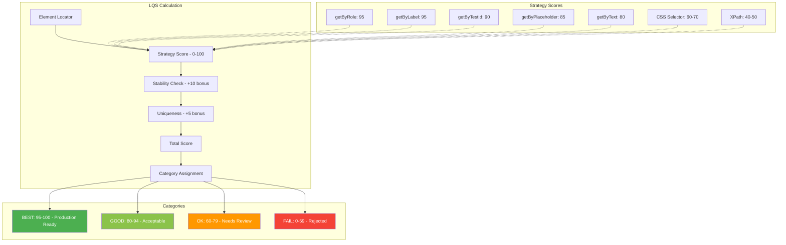

---

## Integration Patterns

### LLM Integration (Optional Enhancement)

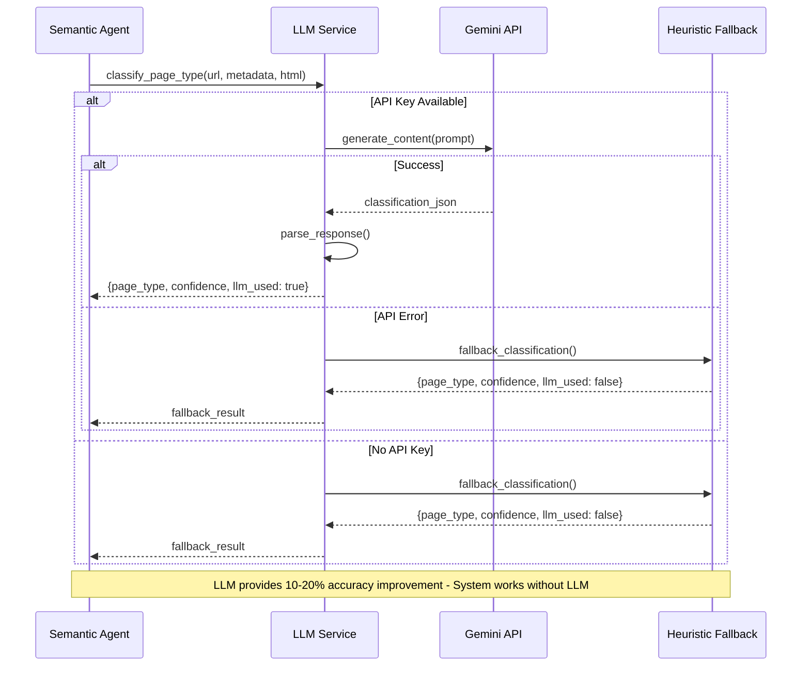

### Centralized Knowledge Base Pattern

```mermaid
graph TB
    subgraph "Session State"
        CKB[Centralized - Knowledge Base]
        STATE[AQMSessionState - - session_id - - url - - current_phase - - artifacts]
    end
    
    subgraph "Artifacts Storage"
        PC[page_context]
        EM[element_map]
        LR[lqs_report]
        TP[test_plan]
        UF[user_fixtures]
        GP[generated_poms]
        GT[generated_tests]
    end
    
    subgraph "Persistence"
        JSON[JSON Files - sessions/]
        DISK[Disk Storage]
    end
    
    CKB --> STATE
    
    STATE --> PC
    STATE --> EM
    STATE --> LR
    STATE --> TP
    STATE --> UF
    STATE --> GP
    STATE --> GT
    
    CKB -->|persist()| JSON
    JSON --> DISK
    DISK -->|load()| CKB
    
    style CKB fill:#607D8B,color:#fff
    style STATE fill:#90A4AE,color:#fff
```

---

## Quality Gates

### Quality Enforcement Flow

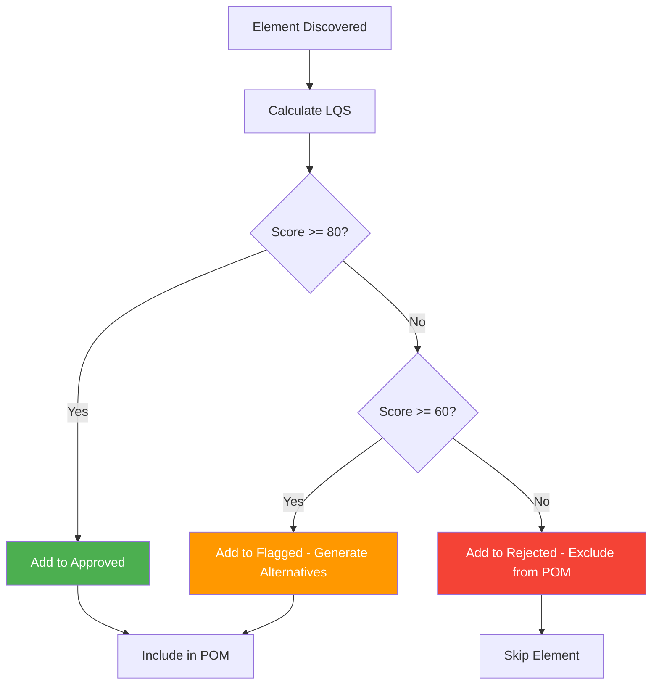

### Quality Metrics Dashboard

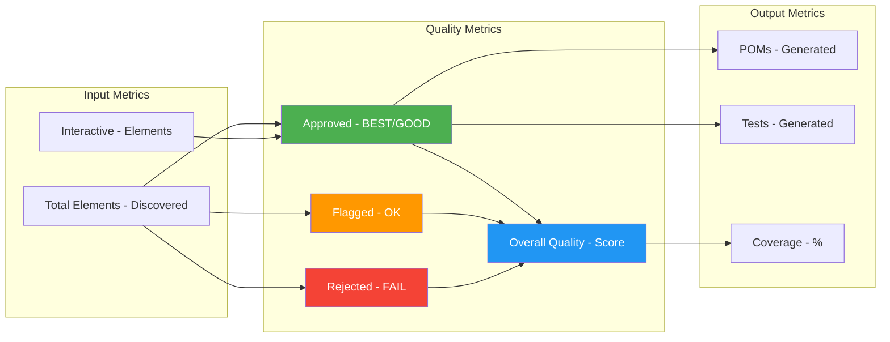

---

## Performance Optimization

### TTLX Reduction Strategy

```mermaid
gantt
    title Sequential vs Parallel Execution
    dateFormat X
    axisFormat %Ls
    
    section Sequential
    Observer (I/O)     :0, 2000
    DOM Analyzer (CPU) :2000, 80
    Semantic (LLM)     :2080, 2000
    
    section Parallel
    Observer (I/O)     :0, 2000
    DOM Analyzer (CPU) :0, 80
    Semantic (LLM)     :0, 2000
```

**Sequential Time**: 4.08s  
**Parallel Time**: 2.00s  
**TTLX Reduction**: 51%

---

## Deployment Architecture

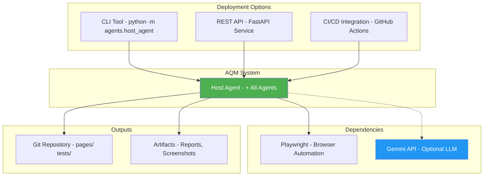

---

## Summary

The AQM system architecture is designed for:

✅ **Modularity**: Each agent has a single, well-defined responsibility  
✅ **Scalability**: Parallel execution for performance  
✅ **Quality**: LQS gates ensure production-ready code  
✅ **Flexibility**: Works with or without LLM enhancement  
✅ **Maintainability**: Clear separation of concerns  
✅ **Extensibility**: Easy to add new agents or features  

**Total Components**: 23  
**Total Lines**: ~5,200  
**Test Coverage**: 25+ tests  
**Status**: Production Ready ✅
